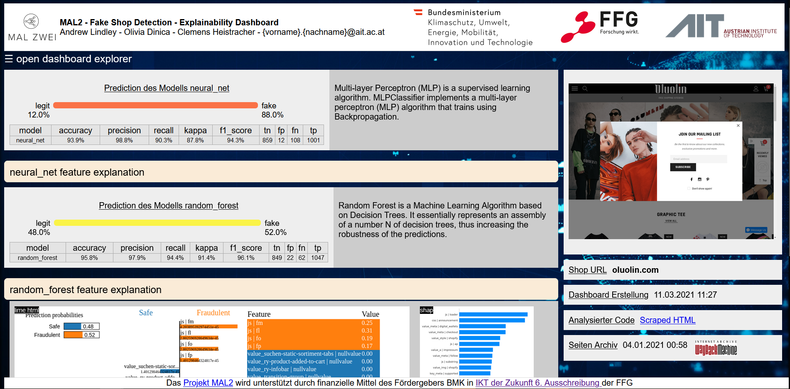

# Fake-Shop Detection Models

## About / Synopsis

* training fake-shop detection models
* provides prediction capabilities on websites
* dashboard builder to captures risk-scores
  * explainability on feature importance
* command line interface or vnc for interaction
* Project status: working/prototype

## Table of contents

> * [Requirements](#requirements)
> * [Installation](#installation)
> * [Usage](#usage)
> * [Running with Docker](#Running-with-Docker)
> * [About MAL2](#about-mal2)
> * [Contact](#contact)
> * [License](#license)

## Requirements

* Ubuntu 16.04
* Python 3.8
* Python-Packages as defined in [requirments.txt](requirements.txt)

## Installation
Create a Python virtual environment with e.g. [virtualenvwrapper](https://virtualenvwrapper.readthedocs.io/en/latest/) or anaconda.
The Python version used is 3.8.

```shell
$ mkvirtualenv -p /path/to/python3.8 mal2-model
```

Install the required Python packages
```shell
pip install -r requirements.txt
```

## Usage

### model training and risk-score verification
Models can be trained on a set of archived html data using:

    python train.py -c [relative path to legit sites] -f [relative path to fraudulent sites]

The accuracy metrics will be outputted in the shell and the model will be saved under files. Currently supported machine learning models are XGBoost and Keras Random Forest, Neural Net.

You can then verify the risk-score of a new site using:

    python verify.py -m [relative path to saved model] -v [relative path to dictionary used by model] -s [site web address]

### expert analysis dashboard

To preserve the risk-score on a specific site a dashboard builder for generating visual html dashboard output is available. It includes the option to run the [kosoh](https://www.kiras.at/gefoerderte-projekte/detail/d/kosoh/) logo classifier to detect trustmarks and payment options, provides API hooks to submit the results to the [fake-shop database](https://github.com/mal2-project/fake-shop-detection_database), options for caching as well as csv handling for batch processing, as well as a basic explainability in the form of feature importance provided by LIME and SHAP.

    python dashboard.py -h
	
with the optional command line arguments
```
  -h, --help            show this help message and exit
  -u [URLS [URLS ...]], --urls [URLS [URLS ...]]
                        URL(s) of the site to check. model based risk-score(s)
                        are predicted on the base url.
  -c [INPUT_CSV], --input-csv [INPUT_CSV]
                        Relative path of CSV input file with URLs in the field
                        'site' to check. model based risk-score(s) are
                        predicted on the base url of every site.
  -m MODEL_DIR, --model-dir MODEL_DIR
                        Relative path to location holding the models and dict
  -d DASHBOARD_DIR, --dashboard-dir DASHBOARD_DIR
                        Relative path to location for dasbhoard results
  -f {lime,shap} [{lime,shap} ...], --feature-importance {lime,shap} [{lime,shap} ...]
                        Options are: lime, shap or no flag for None
  --use-cache           Set flag if you want to use locally cached version of
                        scraped html files - re-scrapes only when site not
                        available locally
  --submit-results      Set flag if you want to submit the results of the
                        model prediction to the fake-shop database for manual
                        inspection
  --identify-logos      Set flag if you want to scrape images and apply the
                        KOSOH trustmark/payment-provider image identifier
```



a sample of the expert analysis dashboard is given in `dashboard/oluolin.com/dashboard.html`

## Running with Docker

For a full local deployment launch the docker build:
```shell
docker-compose up
```

To deploy the service as a stand alone virtual machine with VNC access
```shell
docker build -t ecommerce_mal2-fake-shop-dashboard -f docker/Dockerfile .
```

option one: run with VNC graphical UI
```
docker run --name mal2-dashboard-vnc  --mount type=bind,source=/media/sf_win_repositories/mal2/mal2/eCommerce,target=/root/mal2 -p 6080:80 -p 5900:5900 ecommerce_mal2-fake-shop-dashboard
```
to access the application
launch http://127.0.0.1:6080/#/ or connect on port 5900 using a VNC Client

option two: shell only
```
docker run --name mal2-dashboard-shell -it --entrypoint /root/Desktop/open_mal2_shell.sh --mount type=bind,source=/media/sf_win_repositories/mal2/mal2/eCommerce,target=/root/mal2  ecommerce_mal2-fake-shop-dashboard
```

All details on the docker stand-alon or docker-compose build are provided in the files
`docker-compose.yml`
and
`docker/Dockerfile`

## About MAL2

The MAL2 project applies Deep Neural Networks and Unsupervised Machine Learning to advance cybercrime prevention by a) automating the discovery of fraudulent eCommerce and b) detecting Potentially Harmful Apps (PHAs) in Android.
The goal of the MAL2 project is to provide (i) an Open Source framework and expert tools with integrated functionality along the required pipeline – from malicious data archiving, feature selection and extraction, training of Machine Learning classification and detection models towards explainability in the analysis of results (ii) to execute its components at scale and (iii) to publish an annotated Ground-Truth dataset in both application domains. To raise awareness for cybercrime prevention in the general public, two demonstrators, a Fake-Shop Detection Browser Plugin as well as a Android Malware Detection Android app are released that allow live-inspection and AI based predictions on the trustworthiness of eCommerce sites and Android apps.

The work is based on results carried out in the research project [MAL2 project](https://projekte.ffg.at/projekt/3044975), which was partially funded by the Austrian Federal Ministry for Climate Action, Environment, Energy, Mobility, Innovation and Technology (BMK) through the ICT of the future research program (6th call) managed by the Austrian federal funding agency (FFG).
* Austrian Institute of Technology GmbH, Center for Digital Safety and Security [AIT](https://www.ait.ac.at/)
* Austrian Institute for Applied Telecommunications [ÖIAT](https://www.oiat.at)
* X-NET Services GmbH [XNET](https://x-net.at/de/)
* Kuratorium sicheres Österreich [KSÖ](https://kuratorium-sicheres-oesterreich.at/)
* IKARUS Security Software [IKARUS](https://www.ikarussecurity.com/)

More information is available at [www.malzwei.at](http://www.malzwei.at)

## Contact
For details on behalf of the MAL2 consortium contact: 
Andrew Lindley (project lead)
Research Engineer, Data Science & Artificial Intelligence
Center for Digital Safety and Security, AIT Austrian Institute of Technology GmbH
Giefinggasse 4 | 1210 Vienna | Austria
T +43 50550-4272 | M +43 664 8157848 | F +43 50550-4150
andrew.lindley@ait.ac.at | www.ait.ac.at
or
Woflgang Eibner, X-NET Services GmbH, we@x-net.at

## License
The MAL2 Software stack is dual-licensed under commercial and open source licenses. 
The Software in this repository is subject of the terms and conditions defined in file 'LICENSE.md'

